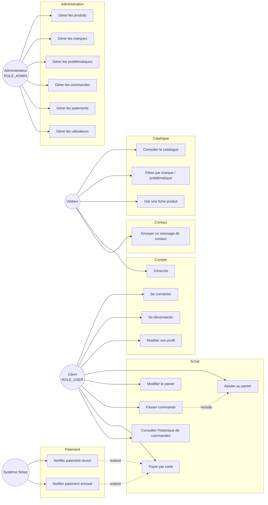
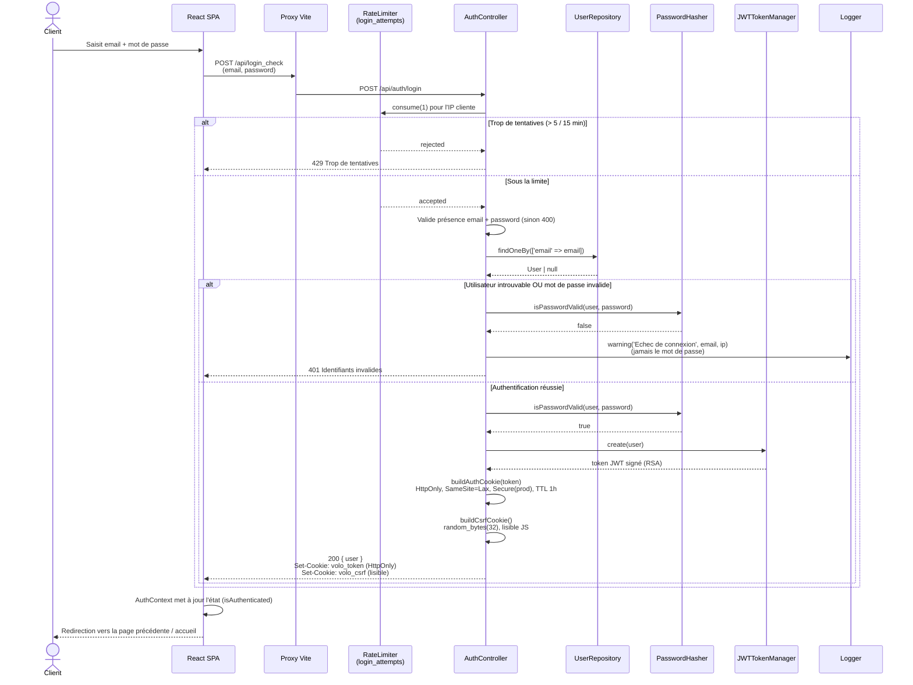

# Diagrammes de cas d'utilisation et de séquence

Ce document complète [PRESENTATION.md](PRESENTATION.md) §5 (qui décrit les acteurs et cas d'utilisation sous forme de tableau) avec des diagrammes Mermaid : un diagramme de cas d'utilisation UML, et deux diagrammes de séquence détaillés (connexion, commande), tous deux vérifiés contre le code réel (`AuthController`, `OrderController`, `OrderService`, `CsrfProtectionSubscriber`).

---

## 1. Diagramme de cas d'utilisation



**Notes de lecture :**

- `Passer commande` **inclut** `Ajouter au panier` : il n'y a pas de commande sans panier préalable.
- `Notifier paiement réussi/échoué` **étend** `Payer par carte` : ce sont des cas d'utilisation déclenchés par un acteur externe (Stripe), asynchrones par rapport à l'action du client.
- Un `Administrateur` ne peut être créé que via la commande console `app:create-admin` — il n'existe aucun cas d'utilisation « S'inscrire en tant qu'admin » (RG11, voir [MODELE_DONNEES.md](MODELE_DONNEES.md)).

---

## 2. Diagramme de séquence — Connexion (Login)

Basé sur `AuthController::login()` (`backend/src/Controller/AuthController.php`).



**Points clés à retenir :**

- Le JWT n'est **jamais** manipulé côté JavaScript — il vit uniquement dans le cookie `HttpOnly` `volo_token`. Le cookie `volo_csrf`, lui, est volontairement lisible : c'est lui que le frontend renvoie dans le header `X-Csrf-Token` sur les requêtes mutantes suivantes.
- Le rate limiting agit **avant** toute requête en base — une attaque par force brute ne génère pas de charge côté BDD au-delà de la limite.
- L'échec de connexion journalise l'email tenté et l'IP, jamais le mot de passe — cf. `AuthController.php` ligne 236-239.

---

## 3. Diagramme de séquence — Commande et paiement

Basé sur `OrderController::create()`, `OrderService::createOrder()`, `PaymentController`, `WebhookController` (parcours complet vérifié le 02/09/2026 avec Stripe CLI, cf. [PRESENTATION.md](PRESENTATION.md) §16).

```mermaid
sequenceDiagram
    actor Client
    participant React as React SPA
    participant Csrf as CsrfProtectionSubscriber
    participant OrderCtrl as OrderController
    participant OrderSvc as OrderService
    participant ProductRepo as ProductRepository
    participant PayCtrl as PaymentController
    participant PaySvc as PaymentService
    participant Gateway as StripePaymentGateway
    participant Stripe
    participant Webhook as WebhookController
    participant DB as Base de données

    Note over Client,React: Panier déjà constitué (CartContext, localStorage)

    Client->>React: Valide l'adresse de livraison
    React->>Csrf: POST /api/orders<br/>{ items[], shippingAddress }<br/>Cookie volo_token + Header X-Csrf-Token

    Csrf->>Csrf: Compare header vs cookie volo_csrf
    alt Token CSRF absent ou invalide
        Csrf-->>React: 403 Forbidden
    else Token valide
        Csrf->>OrderCtrl: create(Request)
        OrderCtrl->>OrderCtrl: denyAccessUnlessGranted(OrderVoter::CREATE)
        OrderCtrl->>OrderSvc: createOrder(data, user)

        OrderSvc->>OrderSvc: new Order() ; status = PENDING
        OrderSvc->>OrderSvc: Valide et copie l'adresse de livraison

        loop Pour chaque item du panier
            OrderSvc->>ProductRepo: find(productId)
            ProductRepo-->>OrderSvc: Product | null
            alt Produit introuvable
                OrderSvc-->>OrderCtrl: throw InvalidArgumentException
            else Produit indisponible (isAvailable = false)
                OrderSvc-->>OrderCtrl: throw InvalidArgumentException
            else Stock insuffisant (stock < quantity)
                OrderSvc-->>OrderCtrl: throw InvalidArgumentException<br/>"Stock insuffisant pour X"
            else Stock disponible
                OrderSvc->>OrderSvc: product.decrementStock(quantity)
                OrderSvc->>OrderSvc: Crée OrderItem<br/>(snapshot productName + unitPrice)
                OrderSvc->>OrderSvc: total += unitPrice * quantity
            end
        end

        alt Une exception a été levée
            OrderCtrl-->>React: 400 { error: message }
        else Tous les items traités
            OrderSvc->>OrderSvc: order.setTotal(total)<br/>(RECALCULÉ côté serveur — RG4)
            OrderSvc->>DB: persist(Order + OrderItems) + flush()
            DB-->>OrderSvc: Order avec id + reference (UUID)
            OrderSvc-->>OrderCtrl: Order
            OrderCtrl-->>React: 201 { data: order }

            React->>PayCtrl: POST /api/payments<br/>{ orderId }
            PayCtrl->>PaySvc: createIntent(order, method)
            PaySvc->>Gateway: createIntent(order)
            Gateway->>Stripe: PaymentIntent.create<br/>(amount en centimes, EUR,<br/>metadata: order_id, reference UUID)
            Stripe-->>Gateway: PaymentIntent { client_secret }
            Gateway-->>PaySvc: PaymentIntentResult
            PaySvc-->>PayCtrl: PaymentIntentResult
            PayCtrl-->>React: 200 { clientSecret }

            React->>Stripe: stripe.confirmCardPayment(clientSecret)<br/>(Stripe Elements — iframe, carte jamais vue par VOLO)
            Stripe-->>React: Confirmation immédiate (UX)

            Note over Stripe,Webhook: Asynchrone — indépendant de la réponse au client
            Stripe->>Webhook: POST /api/webhooks/stripe<br/>payment_intent.succeeded (signé HMAC)
            Webhook->>Webhook: Stripe\Webhook::constructEvent()<br/>vérifie la signature
            Webhook->>DB: Payment → CAPTURED (workflow.apply)
            Webhook->>DB: Order → PAID (workflow.apply, si PENDING)
            Webhook->>Client: Email de confirmation (best-effort)
            Webhook-->>Stripe: 200 OK

            React->>React: Redirection vers /confirmation
            React-->>Client: Page de confirmation (reference UUID affichée)
        end
    end
```

**Points clés à retenir :**

- **Le total n'est jamais fait confiance côté client** (RG4) : `OrderService::createOrder()` recalcule intégralement le montant à partir des prix en base, ligne par ligne.
- **Le stock est vérifié et décrémenté de façon atomique** dans la même transaction que la création de la commande — pas de fenêtre de survente entre la vérification et la décrémentation (`Product::decrementStock()` lève une exception si insuffisant).
- **La confirmation visuelle côté client et la validation métier sont deux choses différentes** : `stripe.confirmCardPayment()` donne un retour immédiat à l'utilisateur, mais c'est **uniquement le webhook signé** qui fait passer `Order` à `PAID`. Un client qui fermerait l'onglet juste après le paiement verrait quand même sa commande validée.
- **Le numéro de carte ne transite jamais par les serveurs VOLO** — Stripe Elements l'encapsule dans un iframe cross-origin.

---

## 4. Cohérence avec le reste de la documentation

| Ce document | Référence croisée |
|---|---|
| Diagramme de cas d'utilisation | [PRESENTATION.md](PRESENTATION.md) §5.1 (tableau acteurs/use cases) |
| Séquence connexion | [CONTRAT_API.md](CONTRAT_API.md) (stratégie JWT + CSRF) |
| Séquence commande | [DIAGRAMME_ETATS.md](DIAGRAMME_ETATS.md) §1-2 (cycle de vie Order/Payment), [MODELE_DONNEES.md](MODELE_DONNEES.md) §6.4 (gestion de stock), RG4 (total recalculé serveur) |
