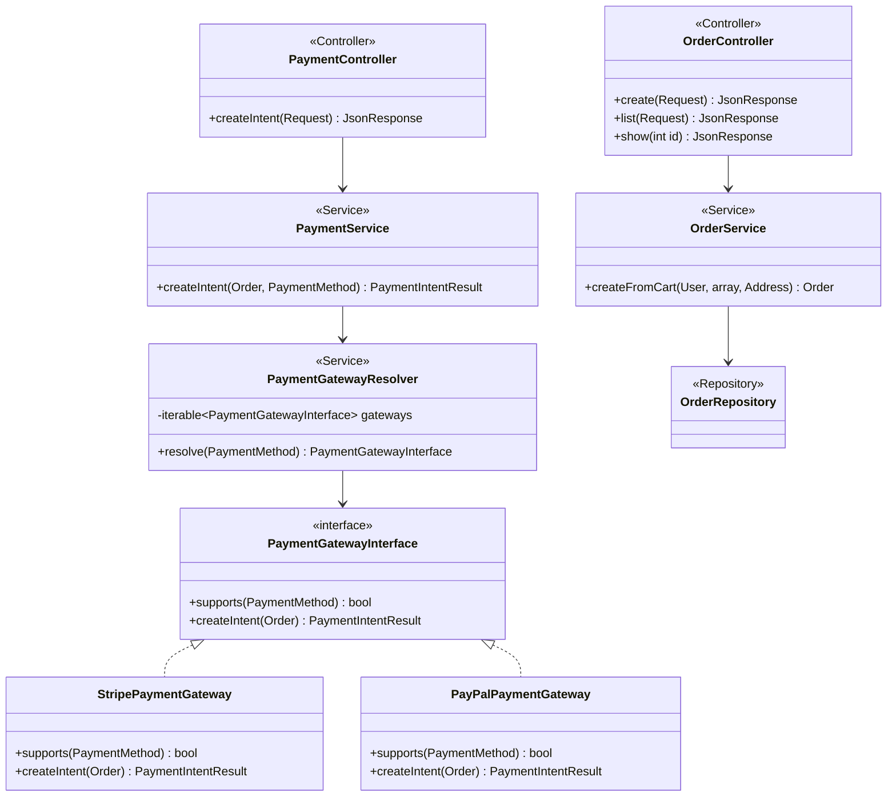
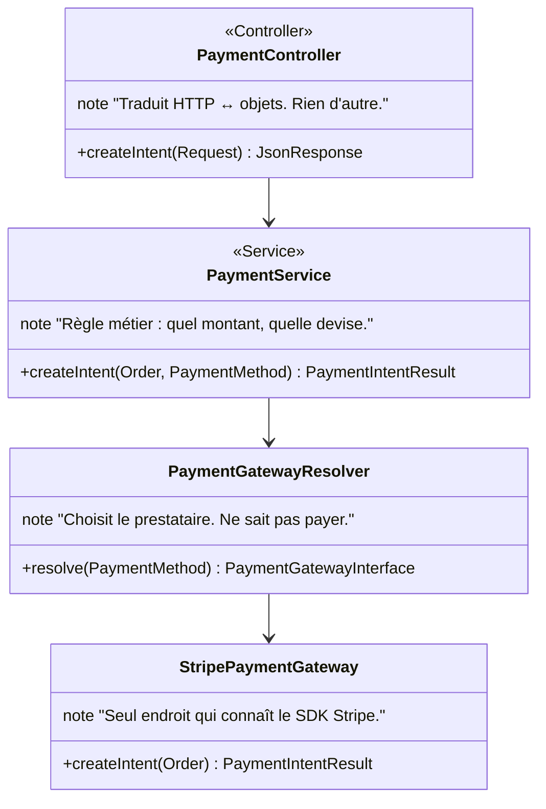
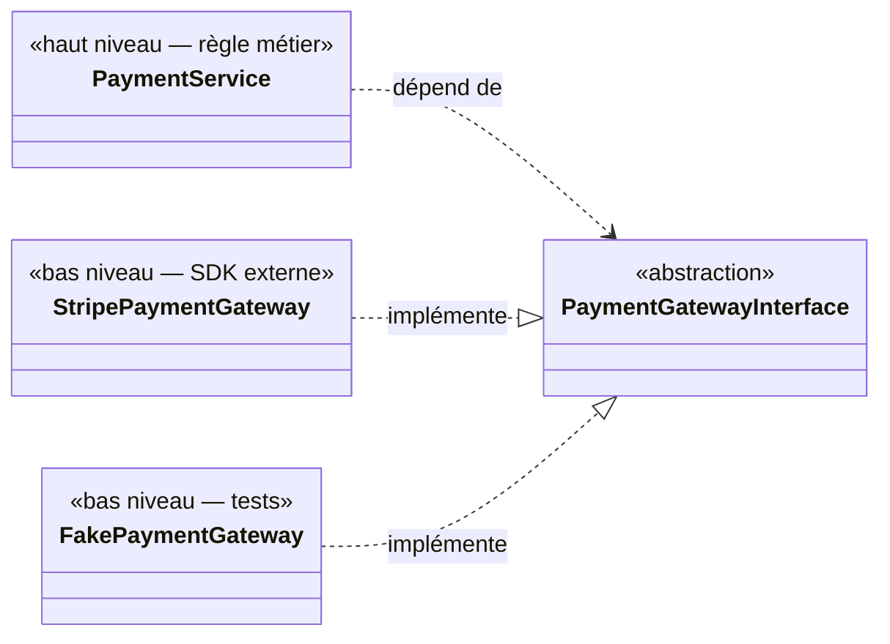

# Diagrammes de classes — SOLID appliqué

[architecture.md](architecture.md) décrit *où* va le code (Controller / Service / Repository). Ce document décrit *pourquoi les classes ont la forme qu'elles ont* — quel principe chaque découpage sert, et ce qu'il coûterait de ne pas le respecter.

Les exemples ne sont pas illustratifs : ce sont les classes réelles de `backend/src/`.

---

## 1. Vue d'ensemble



La flèche importante est celle qui **manque** : aucun `Controller` ne pointe vers un `Repository`, et `PaymentService` ne pointe vers aucune classe Stripe. Les sections suivantes expliquent pourquoi.

---

## 2. SRP — Responsabilité unique

**Le principe** : une classe change pour une seule raison.

### Le contre-exemple, qui était le code réel

La première version de `PaymentController` faisait tout :

```php
// AVANT — ce que le contrôleur contenait réellement
public function createIntent(Request $request): JsonResponse
{
    Stripe::setApiKey($_ENV['STRIPE_SECRET_KEY']);        // configuration
    $data = json_decode($request->getContent(), true);     // désérialisation
    $order = $this->em->getRepository(Order::class)->find($data['orderId']); // persistance
    $intent = PaymentIntent::create([                      // appel externe
        'amount' => $order->getTotal() * 100,
        'currency' => 'eur',
    ]);
    return $this->json(['clientSecret' => $intent->client_secret]);
}
```

Cette méthode change si : Stripe modifie son SDK, la devise change, le calcul du montant change, le format JSON change, la façon de charger une commande change. **Cinq raisons de changer pour une seule méthode.**

### Le découpage retenu



Chaque classe a désormais une raison de changer, et une seule. Le bénéfice n'est pas esthétique : quand la clé API Stripe s'est révélée invalide (bug bloquant réel sur ce projet), le diagnostic était immédiat — un seul fichier pouvait en être la cause.

---

## 3. OCP — Ouvert à l'extension, fermé à la modification

**Le principe** : ajouter un comportement ne doit pas modifier le code existant.

### Le contre-exemple, qui était aussi le code réel

```php
// AVANT — violation de OCP ET de DIP
public function createIntent(Order $order, PaymentMethod $method): array
{
    if ($method === PaymentMethod::CARD) {
        // 20 lignes de Stripe
    } elseif ($method === PaymentMethod::PAYPAL) {
        // 20 lignes de PayPal
    }
}
```

Ajouter Apple Pay = **rouvrir et modifier** `PaymentService`, une classe déjà testée et fonctionnelle. Chaque nouveau moyen de paiement fait grossir un `if/elseif` et risque de casser les précédents.

### La solution en place

```php
interface PaymentGatewayInterface
{
    public function supports(PaymentMethod $method): bool;
    public function createIntent(Order $order): PaymentIntentResult;
}
```

```php
#[AutoconfigureTag('app.payment_gateway')]
interface PaymentGatewayInterface { /* ... */ }
```

```php
class PaymentGatewayResolver
{
    public function __construct(
        // AutowireIterator depuis le 17/07/2026 : TaggedIterator, que ce
        // document donnait ici, est déprécié depuis symfony/dependency-injection 7.1.
        #[AutowireIterator('app.payment_gateway')]
        private iterable $gateways,
    ) {}

    public function resolve(PaymentMethod $method): PaymentGatewayInterface
    {
        foreach ($this->gateways as $gateway) {
            if ($gateway->supports($method)) {
                return $gateway;
            }
        }
        throw new \RuntimeException("Aucune passerelle pour {$method->value}");
    }
}
```

**Ajouter Apple Pay demande maintenant : un fichier neuf, zéro ligne modifiée.** Le conteneur Symfony détecte automatiquement la nouvelle implémentation via le tag et l'injecte dans le resolver. `PaymentService` n'est jamais rouvert.

C'est l'application concrète de `#[AutoconfigureTag]` + `#[AutowireIterator]`, et la raison principale pour laquelle ce refactoring valait le coût : le projet a **déjà** deux moyens de paiement prévus (`PaymentMethod::CARD`, `PaymentMethod::PAYPAL`) — le `if/elseif` était garanti de grossir.

> **Une dépréciation qui coûtait plus qu'il n'y paraît.** Le code utilisait `#[TaggedIterator]`, déprécié depuis Symfony 7.1. Le remplacement est purement nominal — mais son absence rendait la **suite de tests rouge à cache froid et verte à cache chaud** : une dépréciation n'est levée qu'à la compilation du conteneur, et PHPUnit 13 les compte comme des échecs. Sur une CI, qui part toujours d'un cache vide, la suite aurait été rouge en permanence.
>
> Corrigé le 17/07/2026. À retenir : un avertissement de dépréciation ignoré ne reste pas cosmétique — il devient le bruit de fond qui rend un signal rouge inexploitable.

> **Limite assumée** : `PayPalPaymentGateway` est aujourd'hui un stub qui lève `RuntimeException("PayPal non implémenté")`. Il n'est pas là pour faire nombre — il prouve que le point d'extension fonctionne, et il **échoue bruyamment** plutôt que silencieusement. Un client qui choisirait PayPal reçoit une erreur claire, pas un panier qui se vide sans explication.

---

## 4. LSP — Substitution de Liskov

**Le principe** : toute implémentation doit pouvoir remplacer l'interface sans casser l'appelant.

`PaymentGatewayResolver` ne connaît que `PaymentGatewayInterface`. Il ne peut donc pas y avoir de `if ($gateway instanceof StripePaymentGateway)` quelque part — ce serait le signe que le contrat est insuffisant.

Le contrat impose trois choses non écrites dans la signature, et c'est là que LSP se joue :

| Règle | Pourquoi |
|---|---|
| `createIntent()` retourne **toujours** un `PaymentIntentResult`, jamais `null` | L'appelant ne doit pas avoir à tester le retour selon l'implémentation |
| Une erreur de la passerelle lève **toujours** une exception, jamais un retour vide | Sinon l'appelant devrait connaître le mode d'échec de chaque prestataire |
| `supports()` est **pur** — aucun effet de bord, aucun appel réseau | Le resolver l'appelle en boucle sur toutes les passerelles |

`PayPalPaymentGateway` respecte ce contrat en levant une exception — c'est un échec *conforme*. Un stub qui aurait retourné `null` aurait violé LSP et cassé l'appelant, alors même qu'il aurait « compilé ».

### Un cas où LSP a été volontairement écarté

`User` n'a pas de sous-classes `Client` / `Administrateur`. Le rôle est une **donnée** (`roles: array`), pas un type.

C'est un choix : Symfony construit tout son système d'autorisation (`ROLE_USER`, `ROLE_ADMIN`, `#[IsGranted]`, les Voters) sur `UserInterface::getRoles()`. Une hiérarchie de classes obligerait à réimplémenter ce mécanisme, et rendrait impossible qu'un utilisateur cumule des rôles. Le gain LSP serait théorique, le coût réel.

---

## 5. ISP — Ségrégation des interfaces

**Le principe** : aucun client ne doit dépendre de méthodes qu'il n'utilise pas.

`PaymentGatewayInterface` ne contient que deux méthodes. Il aurait été tentant d'y ajouter `refund()`, `capture()`, `verifyWebhookSignature()` — « tant qu'à faire une interface de paiement ».

Ce serait une erreur : `PayPalPaymentGateway`, aujourd'hui un stub, devrait alors implémenter cinq méthodes vides au lieu de deux. Chaque méthode ajoutée à une interface est une dette imposée à **toutes** les implémentations, présentes et futures.

Quand le webhook sera écrit ([DIAGRAMME_ETATS.md](DIAGRAMME_ETATS.md) §2), il aura besoin de vérifier une signature. La bonne réponse sera une **interface séparée** :

```php
interface WebhookVerifierInterface
{
    public function verifySignature(string $payload, string $signature): bool;
}
```

Une passerelle qui gère les webhooks implémentera les deux interfaces ; une passerelle qui n'en gère pas n'implémentera que la première. C'est exactement ce qu'ISP prescrit, et c'est une décision à prendre **avant** d'écrire le webhook, pas après.

---

## 6. DIP — Inversion des dépendances

**Le principe** : les modules de haut niveau ne dépendent pas des modules de bas niveau ; les deux dépendent d'abstractions.



Les deux flèches pointent **vers** l'abstraction : c'est ça, l'inversion. `PaymentService` ne fait `use Stripe\...` nulle part.

**Le bénéfice concret et immédiat** : `PaymentService` est testable sans réseau, sans clé API, sans compte Stripe. Un `FakePaymentGateway` de dix lignes suffit — c'est exactement ce que [STRATEGIE_TESTS.md](STRATEGIE_TESTS.md) §2 exploite.

Sans DIP, tester `PaymentService` exigerait un appel HTTP réel à Stripe à chaque exécution de la suite de tests : lent, dépendant du réseau, et impossible à faire échouer volontairement pour tester le chemin d'erreur.

> ⚠️ **DIP n'est appliqué que sur le paiement.** `OrderService` dépend directement de `OrderRepository` (classe concrète Doctrine), pas d'une `OrderRepositoryInterface`. Ce n'est pas un oubli mais un arbitrage : la couche de persistance n'a qu'une implémentation et n'a aucune raison d'en avoir deux, alors que le paiement en a déjà deux prévues. Inverser aussi la persistance ajouterait une interface par repository pour un bénéfice de testabilité que Doctrine couvre déjà (base SQLite en mémoire).
>
> Ce document assume donc que **SOLID s'applique là où le changement est probable**, pas partout par principe. La conséquence à connaître : tester `OrderService` exigera une vraie base, là où tester `PaymentService` n'exige rien.

---

## 7. Ce que ce document a produit

Deux décisions concrètes sont sorties de cette relecture :

1. **`WebhookVerifierInterface` doit être une interface séparée** (§5) — à décider maintenant, avant l'écriture du webhook, pas après.
2. **DIP est volontairement partiel** (§6) — c'est un arbitrage documenté, pas un oubli. Un relecteur qui verrait `OrderService → OrderRepository` sans cette note pourrait légitimement le prendre pour une incohérence.

Et un rappel de ce que ces refactorings ont réellement coûté et rapporté : le passage de `if/elseif` à `PaymentGatewayInterface` + resolver a représenté cinq fichiers pour zéro fonctionnalité nouvelle. Le retour n'est pas dans le présent — il est le jour où PayPal sera implémenté sans rouvrir une ligne de `PaymentService`.
