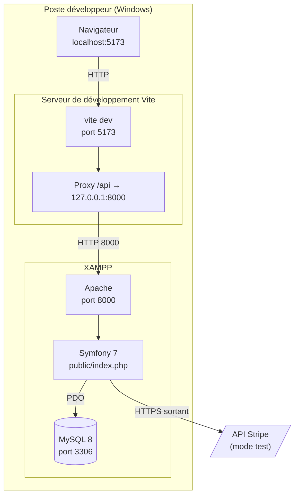
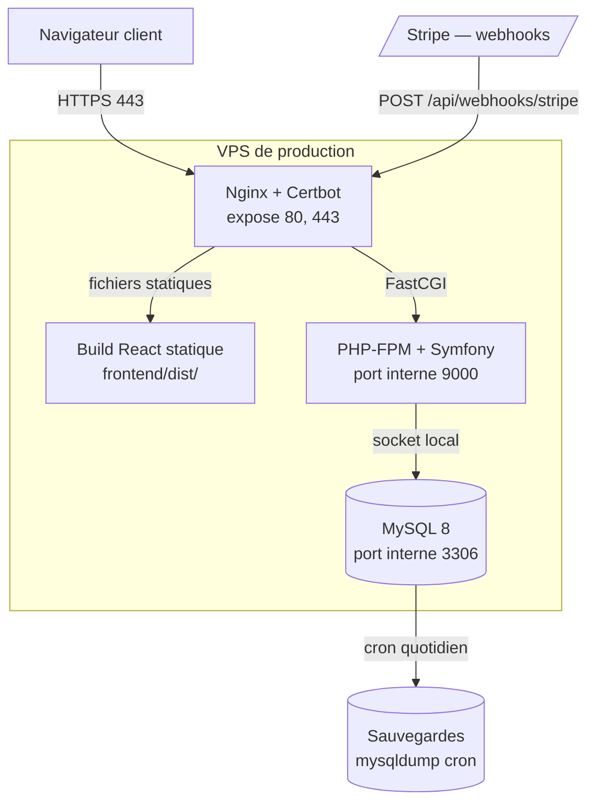

# Diagramme de déploiement

Schématise l'infrastructure décrite en prose dans [architecture.md](architecture.md) §6 et [roadmap.md](roadmap.md) phases 1 et 5.

> **Révisé le 13/09/2026.** L'écart entre conception et réalité, longtemps béant, s'est en grande partie refermé :
>
> - **La pile Docker complète existe** : `docker-compose.yml` à la racine déclare les 5 services (`nginx`, `backend`, `frontend`, `db`, `mailer`), avec `backend/Dockerfile`, `frontend/Dockerfile` et `docker/nginx/default.conf`. `backend/compose.yaml` subsiste à côté, réduit à `db` + `mailer`, pour développer le back sur XAMPP sans monter toute la pile.
> - **Le SGBD est unifié sur MySQL 8.0** depuis le 01/09/2026 (`serverVersion=8.0` dans `DATABASE_URL`, `mysql:8.0` dans les deux fichiers Compose). L'ancien écart MariaDB 10.4 / MySQL 8 — qui avait fait échouer une migration sur `RENAME INDEX`, absent de MariaDB avant 10.5.2 — n'existe plus.
> - **Les sauvegardes existent** : `scripts/backup-db.sh` (mysqldump compressé, rétention 30 jours, mode Docker ou XAMPP).
>
> **Ce qui reste vrai** : aucun déploiement n'a eu lieu sur un serveur réel. La configuration Nginx est écrite et cohérente, mais elle n'a tourné qu'en local. Il n'existe ni environnement de staging, ni secrets de production, ni activation du cron de sauvegarde.
>
> ⚠️ Les noms de services annoncés ailleurs (`volo-api`, `volo-react`, `volo-nginx`) n'existent pas : les services s'appellent `nginx`, `backend`, `frontend`, `db`, `mailer`, seuls les `container_name` portent le préfixe `volo-`.
>
> Ce document distingue systématiquement **ce qui tourne** de **ce qui est prévu**.

Mermaid n'a pas de notation UML « déploiement » native (nœuds en cube, artefacts). Les `subgraph` ci-dessous représentent les **machines**, les boîtes les **artefacts déployés**.

---

## 1. Ce qui tourne aujourd'hui — développement local



**Le proxy Vite est la pièce importante.** Sans lui, le navigateur parle à `localhost:5173` (React) et `localhost:8000` (API) : deux **origines différentes**. Les cookies `volo_token` et `volo_csrf` deviennent alors des cookies tiers, que les navigateurs bloquent de plus en plus agressivement — la connexion échouait silencieusement.

Avec le proxy, tout passe par `localhost:5173`. Une seule origine, cookies traités comme premier partie, et le problème CORS disparaît presque entièrement en développement.

C'est la solution au bug le plus coûteux de la migration vers les cookies `HttpOnly` — et c'est trois lignes dans `vite.config.js` :

```js
server: {
  proxy: { '/api': 'http://127.0.0.1:8000' }
}
```

> **Piège** : `127.0.0.1` et non `localhost`. Sous Windows, `localhost` peut résoudre en IPv6 (`::1`) alors qu'Apache n'écoute qu'en IPv4 — la connexion est alors refusée sans message explicite.

**La flèche vers Stripe n'est plus à sens unique** : `WebhookController` reçoit `POST /api/webhooks/stripe`, vérifie la signature HMAC et fait transiter `Payment` puis `Order` ([DIAGRAMME_ETATS.md](DIAGRAMME_ETATS.md) §2). En développement, l'événement est rejoué avec la CLI Stripe, l'URL publique n'existant pas encore.

---

## 2. Ce qui est prévu — production



### Routage Nginx — la subtilité

Quatre chemins doivent aller à Symfony **alors même que ce sont des pages HTML**, pas des routes d'API :

| Chemin | Servi par | État |
|---|---|---|
| `/api/*` | Symfony | ✅ |
| `/admin/*` | Symfony | ✅ Twig rendu serveur |
| `/sitemap.xml` | Symfony | ✅ `SitemapController` — généré depuis la base |
| `/`, `/soins`, `/soins/{id}`, `/contact` | **Symfony** | ⬜ **`SeoController` n'existe pas** |
| tout le reste | fichiers statiques | La SPA |

La quatrième ligne est contre-intuitive : ce seraient des pages React passant par Symfony. Raison : les aperçus de partage (WhatsApp, Facebook, LinkedIn) n'exécutent **pas** le JavaScript, donc les balises `<meta og:*>` posées par `react-helmet-async` leur sont invisibles. L'idée est que le serveur lise `frontend/dist/index.html` et y injecte les métadonnées avant de le renvoyer.

> ⚠️ **Ni `SeoController` ni `IndexHtmlInjector` n'existent** dans `backend/src/` — vérifié le 17/07/2026. Ce document les décrivait au présent, comme une pièce d'architecture en place. Seul `SitemapController` existe.
>
> Ce routage Nginx est donc doublement théorique : le dispositif qu'il route n'existe pas, et **Nginx non plus** (§1). Concrètement, **les aperçus de partage sociaux ne fonctionnent pas** aujourd'hui.

Google, lui, exécute le JS — le référencement pur fonctionne sans ce dispositif. Il n'aurait servi qu'aux aperçus sociaux, ce qui explique pourquoi il a été jugé non prioritaire — mais il faut alors le dire au futur, pas au présent.

### HTTPS n'est pas optionnel — c'est bloquant

| Port | Exposition | Justification |
|---|---|---|
| 443/tcp | Public | Seul point d'entrée applicatif |
| 80/tcp | Public | Redirection vers 443 + challenge Certbot uniquement |
| 22/tcp (SSH) | Restreint par IP | Déploiement |
| 3306 (MySQL) | **Jamais exposé** | Socket local uniquement |

> ⚠️ **Sans HTTPS, la production ne fonctionnera pas du tout** — pas « moins bien » : pas du tout.
>
> Les cookies `volo_token` et `volo_csrf` portent le drapeau `Secure`. Un navigateur **n'envoie jamais** un cookie `Secure` sur une connexion HTTP. Un déploiement en HTTP produirait donc une connexion qui « réussit » (200 sur `/api/auth/login`) suivie d'un `GET /api/auth/me` en 401, sans aucun message d'erreur explicite.
>
> C'est la conséquence directe et non négociable du choix de §1 de [CONTRAT_API.md](CONTRAT_API.md). La tâche 5.4 de la roadmap est marquée 🟠 Haute ; elle est en réalité **🔴 bloquante**.

---

## 3. Ce qui manque entre les deux

| Élément | État | Conséquence |
|---|---|---|
| `docker-compose.yml` complet | ✅ Présent (5 services) | L'environnement devient reproductible ; reste à l'éprouver sur une machine autre que le poste de développement |
| Déploiement réel | Inexistant | La configuration Nginx n'a jamais tourné ailleurs qu'en local : pour de l'infrastructure, elle est donc à considérer comme non éprouvée |
| Environnement de staging | Inexistant | Rien n'est testé dans des conditions proches de la production avant d'y arriver |
| CI/CD | ⚠️ Un workflow existe mais ne s'exécute pas | `frontend/.github/workflows/react-doctor.yml` est hors de `<racine>/.github/workflows/` : GitHub ne le découvre pas. Ni absent, ni fonctionnel — à déplacer |
| Sauvegardes | ✅ Script présent, cron non activé | `scripts/backup-db.sh` (mysqldump gzip, rétention 30 j) est prêt et testé ; sa planification sur le serveur cible reste à faire |
| Variables d'environnement de prod | Inexistantes | Les secrets de prod n'ont jamais été définis |

Ce qui coûte le plus cher aujourd'hui n'est plus l'absence de Docker, mais l'**absence de déploiement** : la pile est décrite, elle n'a pas été confrontée à un serveur.

---

## 4. Ce que ce document ne couvre pas

- **Haute disponibilité** : un VPS unique = un point de panne unique. Acceptable pour un projet de formation, à ne pas présenter comme une architecture de production.
- **CDN / cache d'images** : les images produits sont servies par Nginx depuis le disque. Suffisant à cette échelle.
- **Un incident de sécurité passé, pour mémoire** : une clé API Stripe (mode test) a été committée dans `.env.dev` et `.env.test`. L'historique Git a été réinitialisé et un `.gitignore` racine unifié mis en place (`.env` / `.env.*` / `!.env.example`, plus robuste que `.env.*.local` qui laissait passer `.env.dev`).

  La leçon vaut d'être écrite : le motif `.env.*.local` recommandé par défaut ne couvre **pas** `.env.dev`. C'est exactement le genre de faux sentiment de sécurité qu'un `.gitignore` mal compris produit.
