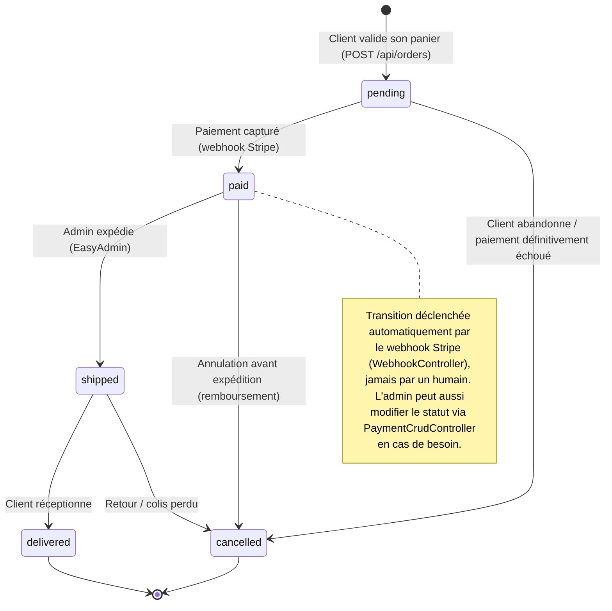
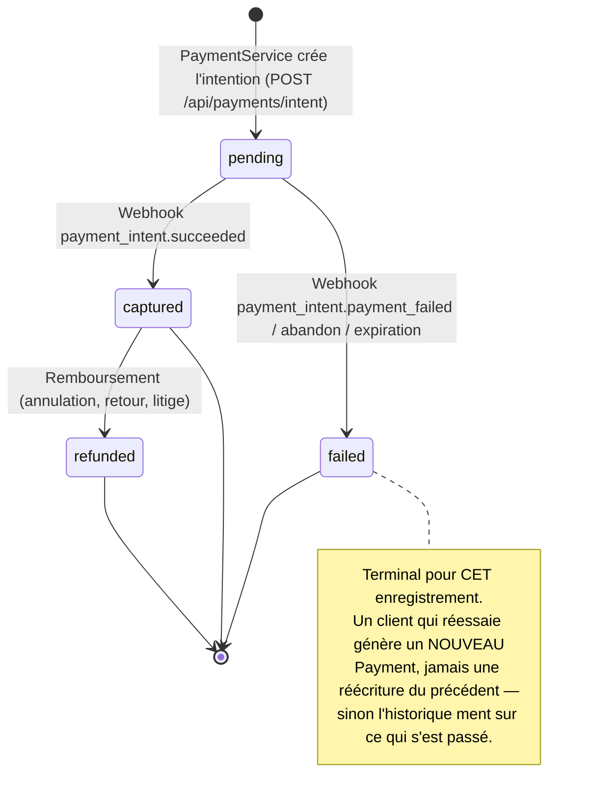

# Diagrammes d'états-transitions

Formalise le cycle de vie de chaque entité qui porte un statut dans [MODELE_DONNEES.md](MODELE_DONNEES.md) — jusqu'ici décrit uniquement en commentaire d'en-tête dans les fichiers `src/Enum/`. Un diagramme d'états rend explicite ce qu'un commentaire laisse implicite : quelles transitions sont **interdites**.

Diagrammes en Mermaid `stateDiagram-v2` (rendu natif GitHub / VS Code).

> ⚠️ **Construire ces diagrammes a fait apparaître trois défauts réels dans le code**, tous documentés à leur place ci-dessous :
> 1. Le statut de paiement était stocké à **deux endroits** (`Order.paymentStatus` et `Payment.status`) sans qu'aucun ne fasse autorité — §3. **Corrigé.**
> 2. Aucune transition n'est **contrainte** : `Order::setStatus()` accepte n'importe quel `OrderStatus` depuis n'importe quel autre — §4.
> 3. `PaymentStatus::REFUNDED` et `OrderStatus::CANCELLED` sont dans les énumérations mais **aucun code ne les pose jamais** — §5.

---

## 1. Commande — le cycle de vie central

`OrderStatus` (`src/Enum/OrderStatus.php`) : `pending` → `paid` → `shipped` → `delivered`, plus `cancelled`.



Ce que le diagramme rend visible et qu'une simple liste d'énumération cachait :

- **`cancelled` a trois points d'entrée**, pas un seul (`pending`, `paid`, `shipped`) — et les conséquences diffèrent radicalement : depuis `pending` aucun argent n'a bougé, depuis `paid` ou `shipped` il faut rembourser. Le code ne fait aujourd'hui aucune de ces distinctions.
- **Aucun retour en arrière** : `shipped → paid` ou `delivered → shipped` n'ont pas de sens métier. Rien dans le code ne les empêche (§4).
- **`delivered` est terminal**, sans état de retour produit — assumé : le cahier des charges ne prévoit pas de gestion des retours en v1.

---

## 2. Paiement — le cycle de vie financier

`PaymentStatus` (`src/Enum/PaymentStatus.php`) : `pending`, `captured`, `failed`, `refunded`.



Un enregistrement financier n'est **jamais remis à `pending`** après avoir atteint un état terminal. C'est ce qui garantit que l'historique affiché au client et le back-office restent une trace fidèle des tentatives réelles.

> ✅ **Résolu.** `WebhookController` (`src/Controller/WebhookController.php`) écoute `POST /api/webhooks/stripe`. Il vérifie la signature HMAC via `Stripe\Webhook::constructEvent()` et traite :
> - `payment_intent.succeeded` → `Payment` passe à `CAPTURED`, `Order` passe à `PAID` (si encore `PENDING`)
> - `payment_intent.payment_failed` → `Payment` passe à `FAILED`
>
> Le webhook est idempotent (un événement déjà traité retourne 200 sans modification) et envoie un email de confirmation via `OrderConfirmationService` (best-effort). Il est exempté du firewall (`PUBLIC_ACCESS`) et du CSRF (signature HMAC à la place).
>
> Le parcours d'achat est désormais complet : le client paie chez Stripe, le webhook fait transiter la commande automatiquement.

---

## 3. ✅ Le statut de paiement était stocké deux fois — corrigé

C'était le défaut de conception le plus sérieux que la rédaction de ce document a mis au jour. Il est résolu ; cette section conserve l'analyse, parce que le raisonnement vaut d'être gardé.

`Order` porte :

```php
#[ORM\Column(type: 'string', length: 50, nullable: true)]
private ?PaymentStatus $paymentStatus = null;

#[ORM\Column(type: 'string', length: 50, nullable: true)]
private ?PaymentMethod $paymentMethod = null;
```

`Payment` porte exactement la même information :

```php
#[ORM\Column(type: 'string', length: 255, enumType: PaymentStatus::class)]
private PaymentStatus $status = PaymentStatus::PENDING;

#[ORM\Column(type: 'string', length: 255, enumType: PaymentMethod::class)]
private PaymentMethod $method;
```

Et `Payment` est déjà lié à `Order` par une relation `OneToOne`. Donc `$order->getPaymentStatus()` et `$order->getPayment()->getStatus()` décrivent la même réalité, dans deux colonnes différentes, sans aucun mécanisme qui garantisse leur cohérence.

**Pourquoi c'est un vrai problème et pas du pinaillage** : le jour où le webhook sera écrit, il devra penser à mettre à jour les deux. S'il n'en met à jour qu'une, le back-office et l'API se contrediront, et rien ne le signalera. C'est exactement le genre de bug silencieux qu'une dénormalisation non assumée produit.

**Deux résolutions possibles** :

| Option | Ce qu'on fait | Coût | Conséquence |
|---|---|---|---|
| **A — Payment fait autorité** | Supprimer `Order.paymentStatus` et `Order.paymentMethod`, lire via `$order->getPayment()` | Une migration + adapter `OrderCrudController` et les DTO de sortie | Une seule source de vérité. Une jointure de plus à chaque lecture de commande |
| **B — Order fait autorité** | Garder les colonnes sur `Order` et supprimer l'entité `Payment` | Perte de l'historique des tentatives : un client qui échoue puis réussit n'a qu'une ligne | Contredit le principe posé en §2 |

**Option A retenue et appliquée.** L'option B économisait une jointure au prix de l'historique financier — le mauvais arbitrage sur un flux d'argent.

Ce qui a définitivement tranché : `PaymentService` n'écrivait **que** sur `Payment`. Les colonnes de `Order` n'étaient alimentées que par EasyAdmin, à la main. Le doublon n'était donc pas un risque futur : **les colonnes de `Order` étaient déjà fausses** dès qu'un paiement passait par l'API.

**Statut : ✅ corrigé** — migration `Version20260717120000`. `Order::getPaymentStatus()` et `getPaymentMethod()` subsistent en lecture seule, dérivés de `Payment`, avec leur `#[Groups('order:read')]` : le JSON de l'API est inchangé. Détail complet et effets de bord : [MODELE_DONNEES.md](MODELE_DONNEES.md) §6.1.

La correction est arrivée **avant** l'écriture du webhook, ce qui était l'enjeu : après, il aurait fallu l'écrire deux fois.

---

## 4. ✅ Les transitions sont désormais contraintes

Les diagrammes ci-dessus décrivent des transitions *autorisées*. Le setter `setStatus()` les acceptait toutes sans vérification — la seule protection était la liste déroulante d'EasyAdmin, une protection d'interface, pas de domaine.

**Résolution appliquée le 01/09/2026** — deux mécanismes complémentaires :

1. **Composant Workflow Symfony** (`config/packages/workflow.yaml`) : déclare les state machines `order` (5 places, 6 transitions) et `payment` (4 places, 3 transitions). `WebhookController` utilise `$workflow->can()` / `$workflow->apply()` pour les transitions automatiques.

2. **`StatusTransitionSubscriber`** (`src/EventSubscriber/StatusTransitionSubscriber.php`) : écouteur Doctrine `preUpdate` qui intercepte **tout** changement de statut (API, EasyAdmin, commande console) et vérifie que la paire (ancien → nouveau) correspond à une transition déclarée dans le workflow. Si non, lève une `LogicException` avant la persistance.

Ce double filet garantit que les diagrammes ci-dessus ne sont plus prospectifs mais **appliqués** : `delivered → pending` ou `cancelled → shipped` sont désormais impossibles quel que soit le point d'entrée.

**Statut : ✅ résolu.**

---

## 5. ⚠️ Deux valeurs d'énumération mortes

Une recherche sur l'ensemble du code donne :

- `PaymentStatus::REFUNDED` — jamais posé nulle part. Aucun code de remboursement n'existe (ni appel `refunds.create` chez Stripe, ni action EasyAdmin).
- `OrderStatus::CANCELLED` — jamais posé non plus. Aucun endpoint d'annulation, aucune action d'annulation dans le back-office.

Ce ne sont pas des erreurs, mais elles rendent les diagrammes ci-dessus partiellement **prospectifs** : les transitions vers `cancelled` et `refunded` décrivent une cible, pas un comportement. C'est signalé ici plutôt que laissé croire que le cycle complet fonctionne.

À trancher : soit on implémente l'annulation (le client doit pouvoir annuler une commande `pending`, c'est une attente de base sur un site marchand), soit on retire les valeurs de l'énumération. Les garder sans les implémenter est le pire des trois choix — le code laisse croire que la fonctionnalité existe.

---

## 6. Compte utilisateur

Il n'existe **aucun** `statut` sur `User` — pas de compte suspendu, pas de validation par e-mail, pas de désactivation. Un compte créé est immédiatement actif.

`UserRole` (`ROLE_USER` / `ROLE_ADMIN`) n'est pas un cycle de vie mais une habilitation : aucune transition automatique, la promotion en `ROLE_ADMIN` passe exclusivement par la commande console `app:create-admin`. C'est délibéré et documenté dans [CONTRAT_API.md](CONTRAT_API.md) §4 : aucun endpoint HTTP ne permet de s'attribuer un rôle.

L'absence de statut de compte est une **simplification assumée** pour la v1. Elle a une conséquence à connaître : il n'y a aucun moyen de bloquer un compte abusif autrement qu'en le supprimant en base — ce qui casserait ses commandes passées par contrainte de clé étrangère.

---

## 7. Synthèse — ce que ce document a produit

| Trouvaille | Gravité | Statut |
|---|---|---|
| Webhook Stripe absent → aucune commande ne passe à `paid` | 🔴 Bloquant fonctionnel | ✅ **Résolu** — `WebhookController` implémenté |
| Statut de paiement dupliqué `Order` / `Payment` | 🔴 Dette de conception | ✅ **Corrigé, appliqué et testé** |
| Aucune transition contrainte dans le code | 🟠 Risque d'incohérence | ✅ **Résolu** — Workflow Symfony + `StatusTransitionSubscriber` (§4) |
| `REFUNDED` / `CANCELLED` jamais posés | 🟡 Énumérations trompeuses | À trancher |
| Aucun statut de compte utilisateur | 🟡 Simplification | Assumé pour la v1 |

Trois de ces cinq points ont été trouvés **en dessinant les diagrammes**, pas en lisant le code linéairement. C'est l'argument concret en faveur de cet exercice de modélisation.

> **Deux corrections apportées à cette synthèse le 17/07/2026** :
>
> **Le doublon n'était pas « ✅ Corrigé » quand ce document l'a écrit.** La migration qui le corrigeait était cassée et n'a jamais pu s'exécuter sur aucune base ([CORRECTION.md](CORRECTION.md)) : ce document a annoncé pendant des semaines un défaut résolu qui ne l'était pas. **Il l'est réellement depuis le 17/07/2026** — migration appliquée sur `volo`, `schema:validate` vert, et le sens du cascade tenu par un test qu'on a vu échouer en réintroduisant le bug.
>
> Ce que §3 affirmait est maintenant vérifiable plutôt que promis : *« le jour où le webhook sera écrit, il devra penser à mettre à jour les deux »* — il n'y en a plus qu'une, et `testEcrireSurPaymentSuffitAChangerCeQueLitOrder` le prouve.
>
> **§4 est désormais résolu (01/09/2026).** Les transitions de statut sont contraintes par le composant Workflow Symfony (`workflow.yaml`) et `StatusTransitionSubscriber` (Doctrine `preUpdate`). `WebhookController` utilise `$workflow->can()` / `$workflow->apply()` pour les transitions automatiques. Toute transition invalide — API, EasyAdmin, console — lève une `LogicException` avant la persistance.
