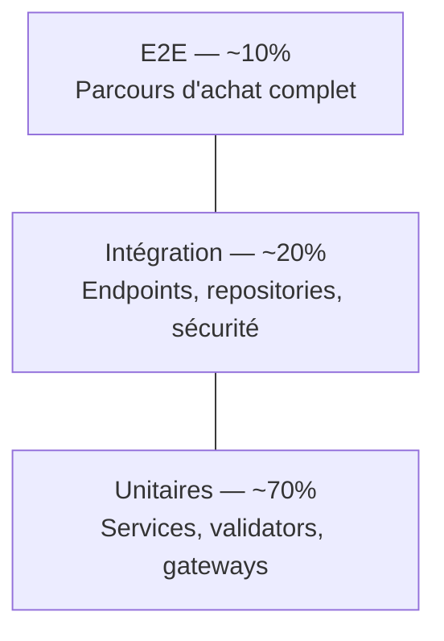

# Stratégie de tests

> **Ce document est le seul endroit du dépôt qui chiffre la suite de tests.** Partout ailleurs, les autres documents renvoient ici plutôt que de recopier un nombre. Raison : un nombre recopié à dix endroits est faux à neuf dès le test suivant — c'est ainsi que « 26 tests » a survécu des mois alors qu'il y en avait 36 (§9). Les chiffres ci-dessous sont un **relevé daté**, pas une propriété du projet ; l'autorité, c'est la CI, qui les recalcule à chaque push.
>
> **Relevé du 14/09/2026 (dernière mise à jour du jour)** — reproductible par `cd backend && php bin/phpunit` et `cd frontend && npx vitest run` :
>
> | Ce qui est mesuré | Valeur relevée | Commande |
> |---|---|---|
> | Suite backend | 110 tests, 269 assertions, verts | `php bin/phpunit` |
> | Suite frontend | 42 tests sur 5 fichiers, verts | `npx vitest run` |
> | Build frontend | passe | `npm run build` |
> | PHPStan `level: max` | 0 erreur hors baseline | `vendor/bin/phpstan analyse` |
> | ESLint | **4 erreurs** — voir réserve ci-dessous | `npx eslint src` |
> | React Doctor 0.9.12 | **94/100**, 2 avertissements | `npm run doctor` |
>
> **Couverture backend, par fichier** : `AuthControllerTest` (inscription, cookies), `CsrfProtectionTest` (double-submit), `OrderPaymentTest` (dérivation du statut, contrat d'API, cascade), `ContactNotificationTest` (persistance + notification email), `WebhookStripeTest` (signature HMAC, idempotence, transitions de statut), `StockReleaseTest` (réservation et restitution du stock, balayage des commandes abandonnées), `AuditSubscriberTest` (traçabilité des modifications), `PaginationBoundsTest` (bornes des paramètres publics), `PaymentSettlementTest` (paiement idempotent, fermeture et remboursement à l'annulation), `ApiInputRobustnessTest` (entrées malformées : 400 ou 404, jamais 500, avec contrôles positifs). **Frontend** : `LoginPage.test.jsx`, `CartContext.test.jsx`, `validators.test.js`, `PasswordInput.test.jsx` (afficher / masquer le mot de passe, sans soumettre le formulaire), `LegalPages.test.jsx` (identité légale rendue : bandeau de pré-production, aucun marqueur « à compléter », espaces préservés autour des valeurs injectées).
>
> **Une réserve à énoncer telle quelle** : ESLint ne sort pas 0 erreur. Les quatre erreurs relèvent de **trois règles différentes** — cette réserve affirmait à tort qu'elles étaient « toutes `react-hooks/set-state-in-effect` » (constaté le 14/09/2026 en relançant ESLint) : `react-hooks/set-state-in-effect` dans `components/NavBar.jsx` et `pages/ProductDetailPage.jsx`, `no-empty` (bloc vide) dans `api/api.js`, et `react-refresh/only-export-components` dans `contexts/ToastContext.jsx`. Elles sont signalées par la CI sans la faire échouer (§9), le temps qu'elles soient traitées.
>
> Ce document existe pour deux raisons : dire quoi écrire quand on s'y mettra, et **nommer précisément ce qui est aujourd'hui non vérifié** — parce que « ça marche quand je clique » n'est pas une vérification.
>
> **Trois obstacles ont dû être levés pour que la suite tourne** — à connaître avant d'écrire de nouveaux tests :
>
> 1. **La base `volo_test` n'existait pas** (Doctrine ajoute le suffixe `_test` via `dbname_suffix`). Il a fallu la créer à la main : `doctrine:database:create` échoue ici, il tente de se connecter à la base avant de la créer.
> 2. **La migration `Version20260717120000` était cassée** et n'avait jamais pu s'appliquer nulle part — donc aucun schéma de test conforme n'était possible avant de la réparer.
> 3. **`.env.local` n'est jamais chargé en environnement `test`.** Symfony l'ignore par conception, pour que les tests donnent le même résultat chez tout le monde. Une variable définie uniquement dans `.env.local` est absente des tests — c'est voulu, et ça surprend une fois.

Il s'appuie sur ce qui a déjà été conçu : les interfaces de [DIAGRAMME_CLASSES.md](DIAGRAMME_CLASSES.md) rendent le mock possible, [DIAGRAMME_ETATS.md](DIAGRAMME_ETATS.md) donne les transitions à couvrir, [CONTRAT_API.md](CONTRAT_API.md) donne ce qu'il faut valider.

---

## 1. Ce qui est aujourd'hui non vérifié

C'est la section la plus importante du document. Chacun de ces mécanismes est **écrit**, aucun n'est **prouvé** :

| Mécanisme | Ce qu'on croit | Ce qu'on sait |
|---|---|---|
| Protection CSRF | Un `POST /api/orders` sans `X-Csrf-Token` → 403 | ✅ **Testé** — `CsrfProtectionTest`, 8 tests |
| Rate limiting | La 6ᵉ tentative → 429 | ✅ **Vérifié** — constaté à l'usage (voir ci-dessous) |
| Hachage EasyAdmin | Le mot de passe créé en back-office est bien haché | ✅ **Vérifié en base** le 14/09/2026 — utilisateur créé par le vrai formulaire EasyAdmin : empreinte bcrypt `$2y$13$`, 60 caractères, jamais stockée en clair. Contrôle scripté, **pas encore un test PHPUnit** |
| Cookie `HttpOnly` | Le JWT est inaccessible au JS | ✅ **Testé** — `testRegister_Success` |
| Autorisation par ressource | Un client ne lit pas la commande d'un autre | 🟡 **Sans objet aujourd'hui** — voir ci-dessous |
| Bornes de pagination | `?limit=100000` ramené à 50, `?limit=-5` et `?page=0` ramenés au plancher | ✅ **Testé** — `PaginationBoundsTest`. Le plafond existait ; **le plancher, non** : les valeurs négatives descendaient jusqu'à Doctrine |

**Sur le rate limiting** : il fonctionne. On l'a appris sans le vouloir — en relançant la suite plusieurs fois, `register_attempts` (5/heure) a rendu des 429 et fait échouer les tests. `setUp()` réinitialise désormais les compteurs. Le limiteur n'est délibérément **pas** neutralisé en environnement test : le neutraliser rendrait impossible de tester le 429 lui-même (§5).

**Sur l'autorisation par ressource** : cette ligne disait « probablement faux » et désignait `GET /api/orders/{id}`. Vérification faite, **cette route n'existe pas** — le test proposé en §10 n'aurait donc rien pu révéler. `GET /api/orders` ne renvoie que les commandes de l'utilisateur courant (`findByUser`). L'absence de Voters reste un risque réel, mais il ne se matérialise nulle part aujourd'hui, faute d'endpoint exposant une ressource par identifiant.

> C'est la leçon la plus utile de cette révision : **ce document désignait la mauvaise porte.** Pendant qu'il surveillait `GET /api/orders/{id}`, un CRUD Twig anonyme traînait sur `/user` et permettait à quiconque de se créer un compte `ROLE_ADMIN`, mot de passe en clair. Aucun test ne le couvrait, et aucune ligne de ce tableau ne le mentionnait. Un raisonnement sur ce qui est *probablement* cassé ne remplace pas un inventaire de ce qui est *réellement* exposé — `debug:router` confronté à `access_control` l'aurait montré en une minute.

**Cette section reste un plan de travail, mais court** : plus aucun mécanisme n'est non vérifié. Le **hachage EasyAdmin** a été contrôlé en base lors de l'audit du 14/09/2026, mais par un script, pas par un test automatisé : il reste à le figer dans la suite. Le rate limiting est constaté à l'usage mais mériterait aussi son test dédié (§5). Toutes les autres lignes sont désormais couvertes.

> **Ce que la ligne « pagination » a appris, et qui vaut d'être gardé.** Elle disait « jamais testé, mais le code existe ». Le code existait effectivement — mais seulement à moitié : il plafonnait `limit` à 50 et ne planchait rien. `?limit=-5` et `?page=0` traversaient donc jusqu'à Doctrine. **« Le code existe » n'est pas « le code est correct »** : c'est précisément ce qu'un test départage, et c'est pour ça qu'une ligne « non testé » ne doit jamais être lue comme rassurante.

---

## 2. Pyramide



Plus on descend, plus les tests sont rapides et isolés. C'est ce que le DIP de [DIAGRAMME_CLASSES.md](DIAGRAMME_CLASSES.md) §6 rend possible — mais **seulement sur le paiement** : `PaymentService` dépend d'une interface, donc testable sans réseau. `OrderService` dépend directement de `OrderRepository`, donc il lui faudra une vraie base. La pyramide de VOLO sera donc plus lourde en intégration qu'un projet où DIP est appliqué partout. C'est la contrepartie assumée de l'arbitrage.

---

## 3. Tests unitaires (PHPUnit)

Aucune dépendance réelle. Exemples concrets à couvrir :

| Classe | Ce qu'on vérifie | Dépendance mockée |
|---|---|---|
| `PasswordValidator` | `"password"` refusé, `"P@ssw0rd"` accepté, `"Aa1!"` refusé (trop court) | Aucune — test pur |
| `PaymentGatewayResolver` | `CARD` → `StripePaymentGateway` ; une méthode sans passerelle → exception | Deux faux gateways |
| `PaymentService` | Le montant envoyé à la passerelle vaut bien `order.total × 100` en centimes | `FakePaymentGateway` |
| `PaymentService` | Une exception de la passerelle ne laisse pas de `Payment` en base à moitié écrit | `FakePaymentGateway` en échec |
| `OrderService` | Le `total` est recalculé serveur — un total falsifié dans la requête est ignoré (RG4) | `EntityManager` mocké |
| `CsrfProtectionSubscriber` | En-tête absent → 403 ; en-tête ≠ cookie → 403 ; `/api/auth/login` → passe | `Request` construite à la main |

La ligne `OrderService` / RG4 est la plus importante : c'est la règle qui empêche un client de s'offrir une commande à 0,01 €. Elle est aujourd'hui appliquée par du code que personne n'a jamais mis à l'épreuve.

---

## 4. Tests des machines à états

[DIAGRAMME_ETATS.md](DIAGRAMME_ETATS.md) §4 le dit : **aucune transition n'est contrainte** dans le code. Il n'y a donc rien à tester aujourd'hui — un test de transition passerait toujours, puisque tout est permis.

L'ordre est donc : **d'abord implémenter les contraintes, puis les tester**. Une fois fait, le test s'écrit comme un produit cartésien :

```php
// Structure — pas une implémentation finale
public static function transitionsAutorisees(): array
{
    return [
        [OrderStatus::PENDING, OrderStatus::PAID],
        [OrderStatus::PENDING, OrderStatus::CANCELLED],
        [OrderStatus::PAID, OrderStatus::SHIPPED],
        [OrderStatus::PAID, OrderStatus::CANCELLED],
        [OrderStatus::SHIPPED, OrderStatus::DELIVERED],
        [OrderStatus::SHIPPED, OrderStatus::CANCELLED],
    ];
}

#[DataProvider('toutesLesPairesDeStatuts')]
public function testTransition(OrderStatus $depuis, OrderStatus $vers): void
{
    $order = (new Order())->setStatus($depuis);
    $autorisee = in_array([$depuis, $vers], self::transitionsAutorisees(), true);

    if ($autorisee) {
        $this->expectNotToPerformAssertions();
        $order->transitionner($vers);
    } else {
        $this->expectException(TransitionInterditeException::class);
        $order->transitionner($vers);
    }
}
```

L'intérêt de la forme cartésienne : ce test **échoue automatiquement** si quelqu'un ajoute un statut à `OrderStatus` sans mettre à jour le tableau des transitions autorisées. Il force l'énumération, le diagramme et le code à rester synchronisés — exactement le type de dérive constatée en §5 de `DIAGRAMME_ETATS.md` (`REFUNDED`/`CANCELLED` présents dans l'énumération, jamais posés nulle part).

---

## 5. Tests d'intégration

Contre une **vraie** base (SQLite en mémoire, ou MySQL éphémère), via `WebTestCase` :

- **`POST /api/orders` sans `X-Csrf-Token` → 403.** Le test qui manque le plus.
- **6ᵉ `POST /api/auth/login` en échec → 429.** Idem.
- **`GET /api/orders/{id}` d'un autre utilisateur → 403.** Écrira le test *et* révélera qu'il échoue — c'est le but.
- **`POST /api/auth/register` avec `{"roles": ["ROLE_ADMIN"]}` → l'utilisateur créé a `["ROLE_USER"]`.** Vérifie RG11.
- **Contrainte `UNIQUE` sur `user.email`** — deux inscriptions au même e-mail. Un mock ne le détecterait pas : il faut une vraie tentative d'insertion.
- **`GET /api/products?limit=100000` → 50 résultats maximum.**
- **`/admin` sans `ROLE_ADMIN` → redirection vers `/admin/login`**, pas une page rendue.

Ces tests ne vérifient pas de la logique métier isolée : ils vérifient le **routage, les firewalls, les subscribers, la sérialisation** — c'est-à-dire précisément la sécurité, qui vit dans la plomberie Symfony et pas dans les services.

---

## 6. Tests end-to-end (Playwright)

Trois parcours prioritaires, correspondant aux diagrammes de séquence existants :

1. **Inscription → connexion → déconnexion.** Y compris le rate limiting réel (blocage après 5 échecs).
2. **Catalogue → détail produit → panier → connexion → commande.** Le parcours de conversion complet.
3. **Connexion admin → création d'un produit → visibilité côté client.**

Le parcours 2 se termine désormais par la page de confirmation (`OrderConfirmationPage.jsx` — ✅ implémentée) avec animations cascade et check SVG animé.

Le paiement Stripe complet est désormais testable E2E — le webhook est implémenté (`WebhookController`). En développement local, `stripe listen --forward-to` permet de recevoir les événements. Le parcours d'achat est complet de bout en bout.

---

## 7. Front-end (Vitest + React Testing Library)

Cohérent avec l'outillage Vite déjà présent. **Trois fichiers de tests existent** :

| Fichier | Ce qui est testé | Statut |
|---|---|---|
| `CartContext.test.jsx` | Panier vide, ajout, incrémentation, calcul total, suppression, mise à jour quantité, clear, persistance/restauration localStorage | ✅ Écrit |
| `LoginPage.test.jsx` | Rendu formulaire, erreurs champ vide/email invalide, login réussi (API + redirect), erreur API, erreur 429, bouton disabled | ✅ Écrit |
| `validators.test.js` | `validateEmail` (6 cas), `validatePassword` (5 cas), `isRequired` (4 cas) | ✅ Écrit |

Composants restants à couvrir, dans cet ordre de priorité :

| Composant | Pourquoi |
|---|---|
| `AuthContext` | Restauration de session via `/auth/me`, déconnexion, état de chargement |
| `CheckoutPage` | Validation avant envoi, gestion des erreurs de paiement |
| `RegisterPage` | Validation, confirmation de mot de passe |

Pas d'objectif de couverture globale : la priorité va à ce qui touche l'argent et l'authentification. Mais tout nouveau composant critique doit arriver avec son test.

**Piège à connaître** : `CartContext` s'initialise directement depuis `localStorage` (initialisation paresseuse du `useState`, pour éviter un scintillement au montage). Un test qui ne nettoie pas `localStorage` entre deux cas verra le panier du test précédent. `beforeEach(() => localStorage.clear())` n'est pas optionnel.

---

## 8. Couverture cible

| Périmètre | Cible | Justification |
|---|---|---|
| `src/Service/` | 80% lignes | Le métier vit là |
| `PaymentService`, `PaymentGatewayResolver`, `OrderService` | 100% des branches | Flux d'argent — zéro tolérance |
| `src/Controller/` | Couvert par les tests d'intégration, pas de seuil de ligne | Un contrôleur ne doit rien contenir à couvrir (SRP) |
| Front | Pas de seuil | Priorité aux composants critiques (§7) |

Viser 100% partout produit un faux sentiment de sécurité : on finit par tester des getters. Viser 100% **des branches sur trois classes précises** est vérifiable et défendable.

> ⚠️ **Ce sont des cibles, et rien ne les mesure aujourd'hui.** Aucun taux de couverture n'a jamais été relevé sur ce projet : la CI tourne avec `coverage: none` (`.github/workflows/ci.yml`), et aucune exécution locale n'a produit de rapport. Ce tableau dit donc où l'on veut aller, **pas où l'on est**. Le lire comme un résultat serait exactement l'erreur que ce document reproche à la version qui annonçait « 20 assertions, toutes vertes » pour un fichier qui n'existait pas.
>
> Mesurer suppose d'activer Xdebug ou PCOV — d'où le coût, et d'où le report assumé.

---

## 9. Pipeline CI

✅ **La CI est en place depuis le 14/09/2026** — `.github/workflows/ci.yml`.

Elle existe pour une raison précise : les affirmations de ce document (« les tests passent », « PHPStan est à 0 erreur », « le front compile ») n'étaient que des déclarations tant que rien ne les exécutait. C'est ainsi que le chiffre « 26 tests » a survécu des mois dans la documentation alors que la suite en comptait dix de plus. Le dépôt vérifie désormais ces affirmations à chaque push — et les chiffres ne sont plus écrits qu'à un seul endroit, en tête de ce document.

| Étape | Bloquante |
|---|---|
| PHPUnit (MySQL 8 en service, base `volo_test`) | Oui |
| PHPStan `level: max` | Oui |
| Vitest + build de production | Oui |
| ESLint | **Non** — voir ci-dessous |
| React Doctor | Non (consultatif) |

**Pourquoi ESLint n'est pas bloquant** : quatre erreurs `react-hooks/set-state-in-effect` préexistent. Les rendre bloquantes mettrait la CI au rouge dès sa mise en place, et une CI durablement rouge finit par être ignorée — ce qui la rend inutile. Elle reste donc signalante. Retirer `continue-on-error` dès que ces quatre erreurs sont traitées.

**Deux pièges rencontrés en la construisant**, qui valent d'être connus :

- Le workflow React Doctor existait mais n'avait **jamais tourné** : il était placé dans `frontend/.github/workflows/`, alors que GitHub ne lit que `<racine>/.github/workflows/`. Il ciblait en outre la branche `main` quand le dépôt est sur `master`. Deux raisons indépendantes pour un même silence.
- La CI part de `.env.example` pour reconstituer `.env`, comme le ferait quelqu'un qui clone. Effet de bord voulu : **si le modèle devient incomplet, la CI casse**. Le modèle est ainsi vérifié, pas seulement promis. C'est d'ailleurs ce mécanisme qui a révélé l'absence de `DEFAULT_URI` dans la première version du modèle.

### Ce qu'il a fallu pour qu'elle passe au vert

Elle n'est pas passée du premier coup, et le dire vaut mieux que de laisser croire le contraire. Trois exécutions :

| Exécution | Backend | Frontend | Cause |
|---|---|---|---|
| 1 | ❌ | ❌ | Création de la base de test ; lock npm |
| 2 | ✅ | ❌ | Lock npm |
| 3 | ✅ | ✅ | — |

**Panne 1 — `doctrine:database:create`.** L'étape échouait (exit 255) pour la raison que ce document consignait déjà en tête : la commande se connecte à la base avant de la créer. Elle *semblait* passer en local uniquement parce que `volo_test` existait déjà et que `--if-not-exists` n'avait rien à faire — **la validation locale de cette étape ne valait donc rien**. Remplacée par un `CREATE DATABASE IF NOT EXISTS` via le client `mysql`, qui n'a pas besoin que la base existe.

**Panne 2 — `npm ci` sous Linux.** `@emnapi/core` et `@emnapi/runtime` étaient présents dans `package-lock.json`, mais **imbriqués** sous `@rolldown/binding-wasm32-wasi/node_modules/`. Sur Linux, npm calcule un arbre qui les attend à la racine : le lock, généré sous Windows, était valide localement et incomplet en CI. Ni une réconciliation du lock existant ni `npm install --os=linux --cpu=x64` n'y changeaient quoi que ce soit — npm considère le lock « à jour » et ne recalcule pas. Il a fallu le régénérer entièrement, ce qui a fait bouger 173 paquets **transitifs** (aucune dépendance directe), tous dans les plages semver déjà déclarées.

**La leçon commune aux deux** : une étape validée sur le poste de développement n'est pas une étape validée. La première panne portait précisément sur celle que j'avais annoncée comme vérifiée, et l'étape que j'avais signalée comme non vérifiable en local (`lexik:jwt:generate-keypair`, cassée par une particularité OpenSSL sous Windows) est passée sans incident.

**Note sur la version de PHP — et sur une erreur de raisonnement qu'elle a produite.**

La CI cible **8.4**. La version précédente de ce paragraphe affirmait : « le projet déclare `>=8.2` et son image Docker de production utilise 8.2 — ce qui fonctionne, celle-ci installant avec `--no-dev` ». **C'était faux, et déduit au lieu d'être vérifié.**

`composer why-not php 8.2` répond sans ambiguïté : six paquets de **production** exigent `^8.4`, dont `doctrine/doctrine-bundle` et `doctrine/doctrine-migrations-bundle`. `--no-dev` n'y change rien — ce sont des dépendances de production. **L'image `php:8.2-fpm-alpine` ne pouvait donc pas se construire**, l'étape `composer install --no-dev` échouant. Personne ne l'avait constaté parce qu'aucun déploiement n'a jamais eu lieu.

Corrigé le 14/09/2026 : `Dockerfile` passé en `php:8.4-fpm-alpine`, `composer.json` déclare `>=8.4`. Le lock n'a bougé que sur son empreinte — aucune version de paquet modifiée.

La leçon est la même que pour la création de la base de test : **« ça devrait fonctionner » n'est pas une vérification.** Une commande d'une seconde départageait, et il a fallu une question sur la solidité du projet pour la taper.

Étapes restant à ajouter :

1. Checkout.
2. `composer install` + `npm ci` (avec cache).
3. Lint : `php-cs-fixer --dry-run`, ESLint.
4. Analyse statique : PHPStan `level: max` — le niveau déjà atteint aujourd'hui. Viser plus bas ferait de la CI une régression.
5. **Tests unitaires** — rapides, échouent vite.
6. MySQL éphémère (service container).
7. `doctrine:migrations:migrate` puis **tests d'intégration**.
8. Vérification de couverture — bloquante sur `PaymentService` / `OrderService`.
9. `npm run build` (front) — vérifie qu'il compile.

Le point 4 mérite d'être noté : PHPStan aurait probablement signalé seul le cascade inversé de [MODELE_DONNEES.md](MODELE_DONNEES.md) §6.2, ou du moins l'aurait rendu visible. C'est l'outil au meilleur rapport effort/trouvailles pour un projet qui part de zéro test.

---

## 10. Par où commencer, concrètement

La suite tourne désormais (`php bin/phpunit`, relevé en tête de document). Reste, dans cet ordre :

1. ~~`POST /api/orders` sans `X-Csrf-Token` → 403~~ — ✅ **fait** (`CsrfProtectionTest`). Ce test a payé immédiatement : il a révélé que `/api/contact`, route publique, était bloquée en 403 pour tout visiteur anonyme. **Le formulaire de contact ne fonctionnait pas.**
2. ~~**Les chemins d'échec**~~ — ✅ **fait le 14/09/2026** (`StockReleaseTest`, `AuditSubscriberTest`). Voir §11.
3. **`PasswordValidator`** — test pur, aucune infrastructure, écrit en 10 minutes. Désormais le moins cher des tests restants.
4. **Rate limiting** : la 6ᵉ tentative → 429. Constaté à l'usage, jamais figé par un test.
5. **Un inventaire, pas un test** : `debug:router` confronté à l'`access_control` de `security.yaml`. Quelle route ne tombe sous aucune règle ? C'est ce qui aurait attrapé `/user`, et rien dans la pyramide de tests ne le remplace.

> **Ce que l'écriture du test CSRF a appris**, et qui vaut pour tous les suivants :
>
> - **Un test de rejet seul ne prouve rien.** « Sans en-tête → 403 » passerait aussi avec un subscriber qui renvoie 403 à *tout le monde*. Il faut le pendant : « avec le bon jeton → ça passe ».
> - **Vérifier qu'un test échoue quand le code est cassé.** En remplaçant la condition du subscriber par `if (false)`, 4 tests virent au rouge. Sans cette manipulation, on ne sait pas si l'assertion mord.
> - **L'ordre des écouteurs compte** : `RouterListener` (32) et le firewall (8) passent avant le contrôle CSRF (0). Une route inexistante rend 404, une requête anonyme rend 401 — dans les deux cas, jamais 403. Un test mal construit prouve que le routeur fonctionne.

> Le point 3 de la version précédente proposait `GET /api/orders/{id}` d'un autre utilisateur, « le plus utile précisément parce qu'il échouera ». Il n'aurait pas échoué : **il aurait produit un 404**, la route n'existant pas. On aurait conclu à tort que la propriété était vérifiée.
>
> L'intuition restait juste : un test qui échoue apprend quelque chose, un test qui passe du premier coup confirme ce qu'on croyait déjà. Mais elle valait pour une route imaginée. **Vérifier qu'une route existe coûte trente secondes et doit précéder le raisonnement sur ce qu'elle protège.**

---

## 11. Les chemins d'échec — ce que la suite ne regardait pas

Ajouté le 14/09/2026 : `tests/Service/StockReleaseTest.php` et `tests/EventSubscriber/AuditSubscriberTest.php`.

**Le constat qui les a motivés.** Tous les tests précédents suivaient le chemin qui réussit : le client paie, le webhook arrive, la commande passe à `paid`. Or les deux défauts les plus coûteux du projet vivaient sur le chemin d'à côté :

| Défaut | Ce que la suite voyait | Ce qui se passait |
|---|---|---|
| Le stock réservé n'était jamais restitué quand le client ne payait pas | Rien — aucun test n'abandonnait de panier | 19 commandes `pending` immobilisaient 22 unités, la plus ancienne datant de juin |
| `AuditSubscriber` persistait depuis `preUpdate`, trop tard pour que Doctrine insère | Rien — la table contenait bien des lignes `create` | **Aucune modification n'a jamais été tracée.** Pas d'erreur, pas d'avertissement |

Les deux ont la même signature : **l'absence a la même apparence que le bon fonctionnement**. Une piste d'audit qui ne trace rien ressemble à une piste d'audit calme ; un stock qui ne revient pas ressemble à un stock qui se vend.

**Ces tests ont été éprouvés par mutation**, comme le demande §10 :

| Mutation appliquée | Résultat |
|---|---|
| `incrementStock()` retiré de `releaseStock()` | Rouge |
| `computeChangeSet()` retiré de `AuditSubscriber::onFlush()` — le bug historique exact | 5 des 7 tests d'audit en erreur |

Le code a été restauré ensuite (`git diff` vide sur les deux fichiers).

**Deux choses apprises en les écrivant**, qui valent pour les tests suivants :

1. **PHP tourne en UTC, MySQL en heure locale.** Vieillir une commande avec `DATE_SUB(NOW(), INTERVAL 120 MINUTE)` était exactement annulé par les deux heures d'écart, et donnait l'apparence d'un bug dans `findStalePending`. L'application ne mélange jamais les deux horloges — Doctrine écrit `created_at` depuis PHP et la requête le compare à un `DateTimeImmutable` PHP. Un test qui introduit `NOW()` mesure le fuseau du serveur, pas le code.
2. **Une garde défensive peut protéger d'un état impossible.** `releaseStock()` ignore une ligne de commande sans produit ; la contrainte `FK_52EA1F094584665A` interdit cet état, `OrderItem::$product` étant `nullable: false`. La branche est donc couverte en mémoire, pas en base, et le test le dit. Elle garde son intérêt pour un futur `ON DELETE SET NULL` — mais il ne faut pas la présenter comme protégeant d'un scénario réel aujourd'hui.

**Un contrat volontairement figé** : `testReleaseStockNestPasIdempotent` vérifie qu'un double appel restitue deux fois. Ce n'est pas un comportement souhaitable, c'est le contrat documenté du service — l'idempotence est déléguée à la machine à états, dont la garde ne laisse passer `cancel_pending` qu'une fois. Si ce test devient rouge, une garde a été ajoutée dans le service, et il faut alors vérifier que les appelants ne comptent plus sur la machine à états pour cela.
